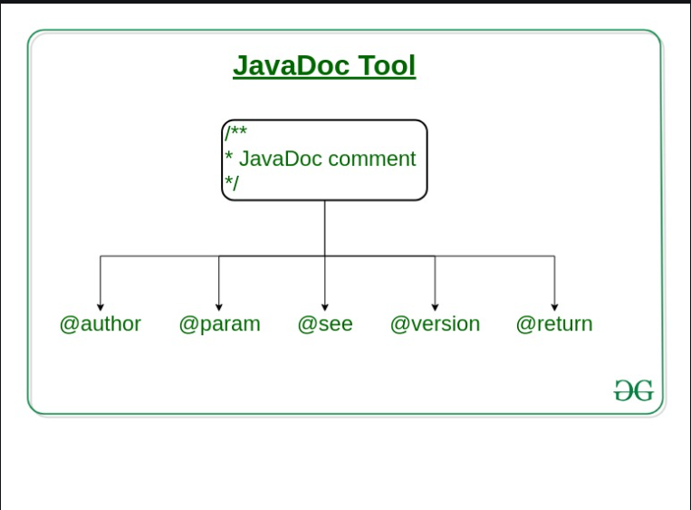
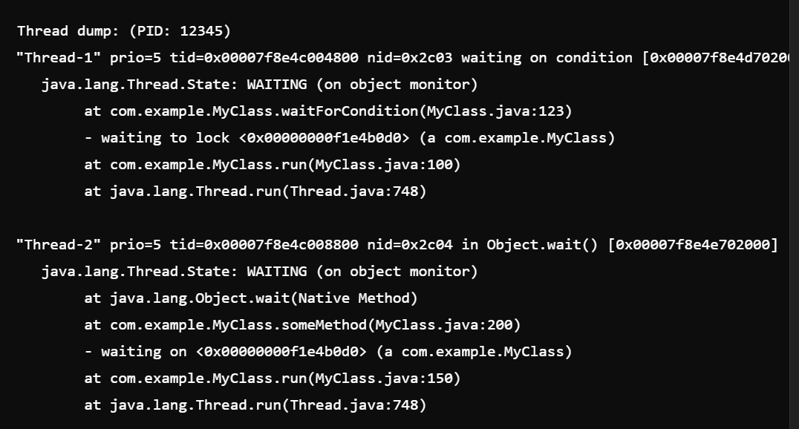
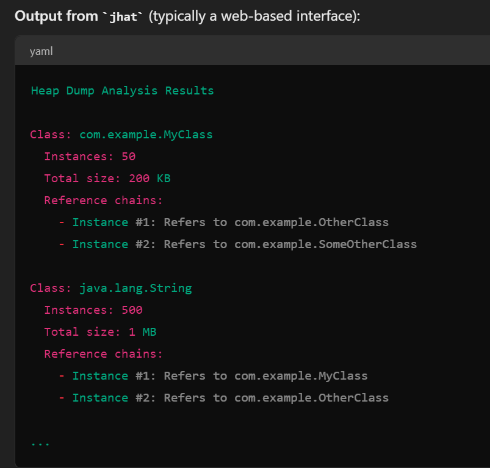
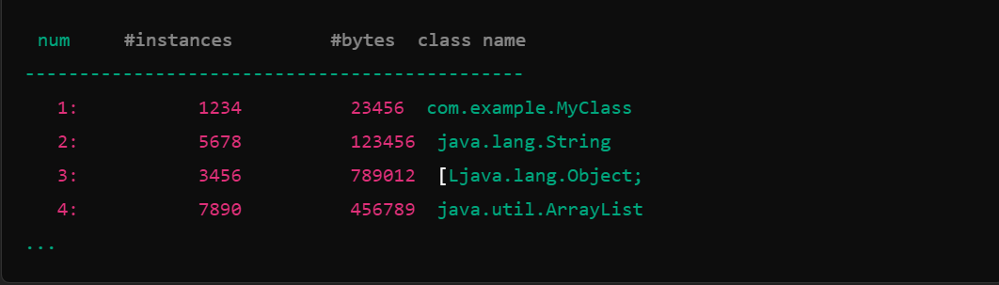

# Core Java Notes
---
## JDK 
JDK = Tools + Docs + Libraries + RE 

### Tools
1. **javac:** Source code => bytecode.
2. **java:** The Java Application Launcher, which runs Java applications by starting the Java Virtual Machine (JVM).
3. **javadoc:** Sorce code => HTML Documentation [https://www.geeksforgeeks.org/what-is-javadoc-tool-and-how-to-use-it/]
4. **jar:** The Java Archive tool that packages related class files into a single JAR file for distribution.
5. **jdb:** The Java Debugger
6. **javap:** The Class File Disassembler, which disassembles class files to aid in understanding compiled bytecode.
7. **jps:** The Java Process Status tool, which lists the instrumented HotSpot Java Virtual Machines (JVMs) on the target system.
8. **jstat:** The JVM Statistics Monitoring Tool, which monitors various JVM statistics.
9. **jstack:** The Stack Trace Tool, which prints Java thread stack traces for a Java process.
10. **jmap:** The Memory Map Tool, which prints shared object memory maps or <u>heap memory details</u> for a Java process.
11. **jcmd:** A tool to send diagnostic command requests to a running JVM.
12. **jshell:** The Java Shell (Read-Eval-Print Loop) tool, which provides an interactive tool to evaluate Java code snippets.
---

#### `javadoc` Tool: 
- include JavaDoc comments /**………………..*/ 
-   ```java
        // Single-Line Comment

        /* 
        * Multiple-Line comment
        */

        /** 
        * JavaDoc comment
        */
    ```

- 
 
- ```bash 
    javadoc file_name or javadoc package_name
  ```  


#### `javap` Tool:
- The Class File Disassembler, which disassembles class files to aid in understanding compiled bytecode.
- provides information about the class, such as its methods and fields.
- useful for developers who need to understand the bytecode generated by the Java compiler.
- Using `javap`, you can gain insights into the compiled bytecode and better understand how the Java Virtual Machine (JVM) executes your code.
- Some commonly used options with javap include:
    `-c:` Disassembles the code (shows the bytecode instructions).
    `-s:` Prints internal type signatures.
    `-p:` Shows private and protected members in addition to public ones.
    `-verbose:` Displays additional information, including stack size, number of locals, and method arguments.

####  `jps` Tool: 
- used to display the process IDs (PIDs) of all Java processes running on a machine. It's a helpful tool for Java developers and system administrators to monitor and manage Java applications.

####  `jstat` Tool: 
- use `jstat` by specifying the type of information you want and the process ID (PID) of the JVM you want to monitor. For example, `jstat -gc <pid>` displays garbage collection statistics.
- Common Options:
    `-class:` Displays class loading information.
    `-gc:` Shows garbage collection statistics, including heap usage and garbage collection counts.
    `-gccapacity:` Provides details about the capacities of the garbage collection spaces.
    `-gcutil:` Gives a summary of the utilization of the garbage collection spaces.
    `-printcompilation:` Lists the methods compiled by the Just-In-Time (JIT) compiler.
    `-heap:` Shows detailed information about heap memory usage.
    1. `jstat -gc <pid>`
        This command displays garbage collection statistics. Here’s a breakdown of the output columns:
        **S0C:** Size of survivor space 0 (in KB).
        **S1C:** Size of survivor space 1 (in KB).
        **SCM:** Size of the code cache (in KB).
        **EC:** Size of the eden space (in KB).
        **OC:** Size of the old space (in KB).
        **MC:** Size of the metaspace (in KB).
        **YGC:** Number of young generation garbage collections.
        **FGC:** Number of full garbage collections.
        **FGCT:** Time spent in full garbage collections.
    2. `jstat -class <pid>`
        This provides information about the class loading. Output columns typically include:
        **Loaded:** Number of loaded classes.
        **Bytes:** Bytes of loaded classes.
        **Unloaded:** Number of unloaded classes.
        **Bytes:** Bytes of unloaded classes

####  `jstack` Tool: 
- used to get the stack traces of all threads in that process.
- 

####  `jmap` Tool: 

*  Key Functions of jmap
1. **Heap Dump:** Captures a snapshot of the Java heap memory, which can be useful for debugging and analyzing memory usage.
    ```bash
        jmap -dump:format=b,file=heapdump.hprof <pid>
    ```
    - **Output:**
    The jmap -dump command itself does not produce output directly to the console but writes a binary file (`heapdump.hprof` in this case) that contains the heap dump. 
    You can analyze this file using tools like:
        - Eclipse MAT (Memory Analyzer Tool)
        - VisualVM
        - jhat (Java Heap Analysis Tool)

    
2. **Heap Histogram:** Provides a summary of the objects in the heap, including the number of instances and the total amount of memory used by each class.
    ```bash
        jmap -histo <pid>
    ```
     
3. **GC Roots:** Shows the roots of the garbage collection, which can be helpful in analyzing memory leaks.
    ```bash
        jmap -clstats <pid>
    ```
4. **Object Details:** Displays information about specific objects in the heap.
    ```bash
        jmap -dump:format=b,file=heapdump.hprof <pid>
    ```