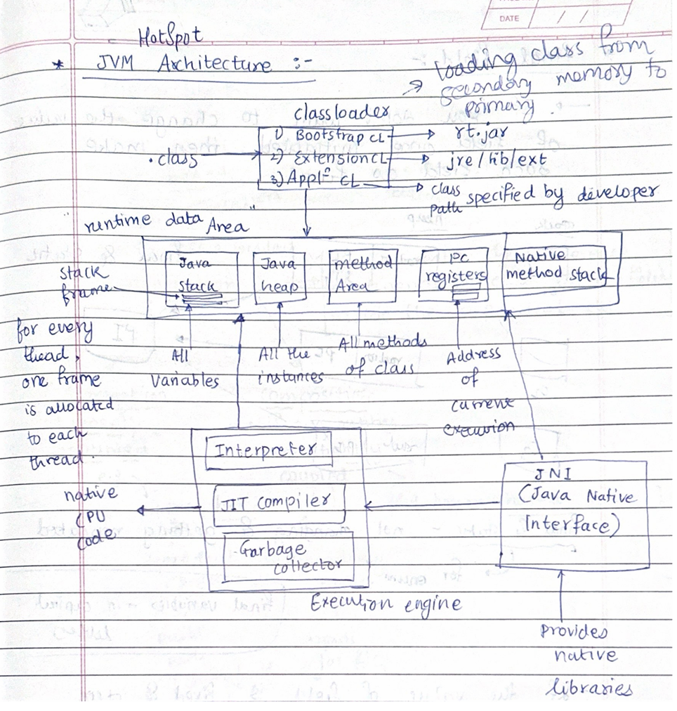

# Core Java Notes
---
## JVM (Java Runtime Environment) 

- **JVM HotSpot Architecture** 

# JVM Options

## Standard Options
- **-cp or -classpath**: Specifies the class path.
- **-D<name>=<value>**: Sets a system property.
- **-verbose**: Enables verbose output.
- **-version**: Displays the version information.
- **-showversion**: Displays version information and continues execution.
- **-server**: Selects the server JVM.
- **-client**: Selects the client JVM.

## Non-standard Options (-X options)
- **-Xms<size>**: Sets the initial heap size.
- **-Xmx<size>**: Sets the maximum heap size.
- **-Xss<size>**: Sets the stack size for each thread.
- **-Xmn<size>**: Sets the size of the young generation.
- **-Xloggc:<file>**: Logs GC status to a file.
- **-Xint**: Runs the JVM in interpreted-only mode.
- **-Xcomp**: Runs the JVM in compile-only mode.
- **-Xbatch**: Disables background compilation.
- **-Xprof**: Outputs CPU profiling data.

## Advanced Options (-XX options)
- **-XX:InitialHeapSize=<size>**: Sets the initial heap size.
- **-XX:MaxHeapSize=<size>**: Sets the maximum heap size.
- **-XX:NewSize=<size>**: Sets the initial size of the young generation.
- **-XX:MaxNewSize=<size>**: Sets the maximum size of the young generation.
- **-XX:PermSize=<size>**: Sets the initial size of the permanent generation.
- **-XX:MaxPermSize=<size>**: Sets the maximum size of the permanent generation.
- **-XX:SurvivorRatio=<ratio>**: Sets the ratio between Eden and survivor spaces.
- **-XX:NewRatio=<ratio>**: Sets the ratio between the young and old generation sizes.
- **-XX:MaxTenuringThreshold=<threshold>**: Sets the maximum tenuring threshold.
- **-XX:ParallelGCThreads=<threads>**: Sets the number of threads used for parallel GC.
- **-XX:+UseParallelGC**: Enables the parallel garbage collector.
- **-XX:+UseConcMarkSweepGC**: Enables the concurrent mark-sweep (CMS) garbage collector.
- **-XX:+UseG1GC**: Enables the G1 garbage collector.
- **-XX:InitiatingHeapOccupancyPercent=<percent>**: Sets the heap occupancy threshold for triggering a GC.
- **-XX:+PrintGC**: Prints GC details.
- **-XX:+PrintGCDetails**: Prints detailed GC information.
- **-XX:+PrintGCTimeStamps**: Prints timestamps at GC events.


- **JVM Tuning Parameters**

Command to add parameters: 
```bash
java -Xms512m -Xmx1024m -jar myapp.jar
java -Xms0.5g -Xmx1g -jar myapp.jar
```

JVM tuning involves adjusting parameters to optimize 
1. **Performance**
    - JIT Compiler Parameters:
        - `-XX:CompileThreshold=n`: Number of method invocations/loops before compilation.
        - `-XX:+AggressiveOpts`: Enable aggressive performance optimizations.
    - Thread Management:
        - `-XX:+UseThreadPriorities`: Enable thread priorities.
        - `-XX:ThreadStackSize=size`: Set the thread stack size.
2. **Memory Management**
    - **Heap Size Parameters:**
        - `-Xms<size>`: Sets the initial heap size.
        - `-Xmx<size>`: Sets the maximum heap size.
    - **New Generation Size Parameters:**
        - `-Xmn<size>`: Sets the size of the young generation.
        - `-XX:NewRatio=n`: Ratio between the old and new generation sizes.
        - `-XX:SurvivorRatio=n`: Ratio between Eden space and Survivor spaces in the young generation.
    - **Metaspace Parameters (for Java 8 and later)**:
        - `-XX:MetaspaceSize=size`: Initial size of the Metaspace.
        - `-XX:MaxMetaspaceSize=size`: Maximum size of the Metaspace
3. **Garbage Collection**
    - **Selecting a Garbage Collector:**
        - `-XX:+UseSerialGC`: Use the serial garbage collector.
        - `-XX:+UseParallelGC`: Use the parallel garbage collector (default for many JVMs).
        - `-XX:+UseConcMarkSweepGC`: Use the concurrent mark-sweep (CMS) garbage collector.
        - `-XX:+UseG1GC`: Use the G1 garbage collector.
   
    - **Garbage Collection Tuning:**
        - `-XX:ParallelGCThreads=n`: Number of threads for parallel garbage collection.
        - `-XX:ConcGCThreads=n`: Number of threads for concurrent garbage collection.
        - `-XX:MaxGCPauseMillis=ms`: Max pause time for garbage collection.
        - `-XX:GCTimeRatio=n`: Ratio of time spent in garbage collection versus application time

## Interview Questions on JVM:
[https://www.javamadesoeasy.com/2017/03/top-30-jvmjava-virtual-machine.html]

- You can resolve “java.lang.OutOfMemoryError : unable to create new native Thread” by setting the appropriate size using -Xss vm option. 
    - Solution 1 to “java.lang.OutOfMemoryError : unable to create new native Thread”  >
    Try to increase the the -Xss value so that new threads gets enough stack space.

    - Solution 2 to “java.lang.OutOfMemoryError : unable to create new native Thread”  >
    Alternatively you could also increase the heap size available using -Xms and -Xmx options and then try to increase and set appropriate -Xss value.


## Interpreter in JVM
- The interpreter in the JVM reads Java bytecode instructions and executes them one by one.
- It translates each bytecode instruction into machine code (native instructions) at runtime.
- While interpreting is straightforward and requires less memory, it can be relatively slow since each instruction must be translated every time it is encountered.

## Just-In-Time (JIT) Compiler in JVM
- The JIT compiler improves performance by compiling bytecode into native machine code at runtime, but unlike the interpreter, it does this for entire methods or **frequently executed code** segments.
- Once a piece of bytecode is compiled to native code, it can be executed directly by the CPU **without further translation**, significantly speeding up execution.
- The JIT compiler uses various optimization techniques to enhance performance, such as inlining, loop unrolling, and escape analysis.

## How Interpreter and JIT Compiler Work Together
- Initially, the JVM uses the interpreter to quickly start the execution of Java programs. This allows the program to start running without the overhead of compilation.
- As the program runs, the JVM monitors the performance and identifies **"hot spots"** – parts of the code that are executed frequently.
- The JIT compiler then compiles these hot spots into native code & store it in the cache memory(`code cache`), optimizing them for better performance.
- This hybrid approach ensures a quick startup (thanks to the interpreter) and high execution speed for critical parts of the application (thanks to the JIT compiler).

##  Inlining, loop unrolling, and escape analysis: 
1. **Inlining**
Inlining is a performance optimization technique where the compiler replaces a function call with the actual code of the function. This eliminates the overhead of the call and return sequence, and can also enable further optimizations.

**Benefits:**
- **Elimination of Call Overhead:** Function calls involve overhead such as saving registers, passing parameters, and jumping to the function's code. Inlining removes this overhead.
- **Enhanced Optimization:** When the function code is inlined, it can be optimized together with the caller code. This can lead to additional optimizations such as constant propagation and dead code elimination.

2. **Loop Unrolling**
Loop unrolling is a technique where the loop's iteration code is duplicated multiple times to reduce the overhead of loop control. This can also expose more opportunities for further optimizations.

Before unrolling:
```java
    for (int i = 0; i < 4; ++i) {
        array[i] = 0;
    }
```
After unrolling
```java
    array[0] = 0;
    array[1] = 0;
    array[2] = 0;
    array[3] = 0;
```
**Benefits:**
- **Reduced Loop Control Overhead:** By decreasing the number of iterations, the overhead of incrementing counters and checking *loop conditions is reduced.*
- **Increased Parallelism:** It can expose more independent operations to the compiler, which can be executed in parallel.

3. **Escape Analysis**
Escape Analysis is a technique used to analyze the dynamic behavior of object references to determine where they are accessible or "escape" to outside their local scope. The primary goal is to optimize memory allocation and improve performance

**Escape:** An object "escapes" if it can be accessed outside the scope in which it was created. 

**Benefits:**
Optimization Techniques Enabled by Escape Analysis
1. **Stack Allocation:**

- **Stack vs. Heap:** Traditionally, objects are allocated on the heap, which involves more overhead for garbage collection and memory management. If escape analysis determines that an object does not escape a method or a thread, it can be allocated on the stack.
- **Benefits:** Stack allocation is faster because it involves simple memory management (just adjusting the stack pointer) and avoids the overhead of garbage collection.

2. **Synchronization Elimination:**

- **Thread-Local Objects:** If an object is confined to a single thread (does not escape the thread's scope), synchronization on that object can be eliminated because there's no risk of concurrent access.
- **Benefits:** Reduces overhead related to synchronization, improving performance in multi-threaded environments.