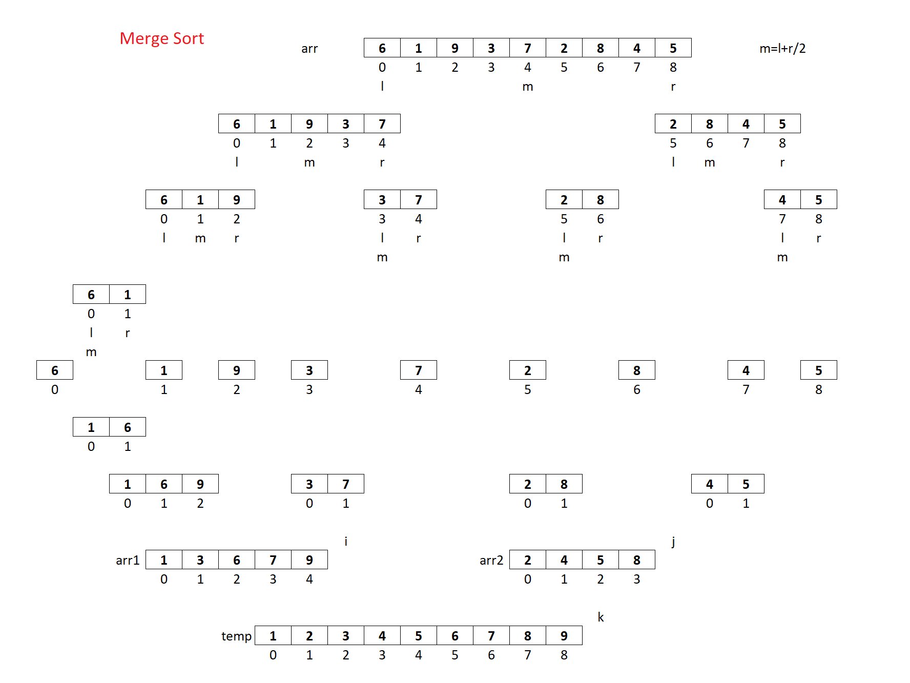
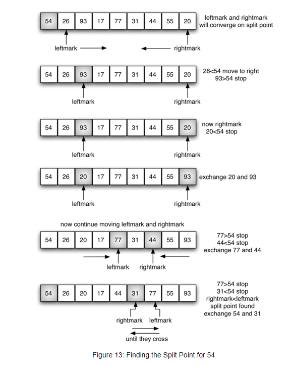
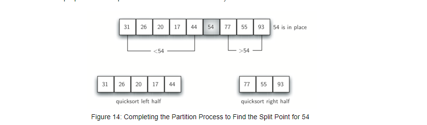

# Characteristics of Sorting Algorithms:
**Stability:** If the relative **order of equal elements is preserved** after sorting.
**In-Place Sorting:** does not require additional memory to sort the data.

# Sorting Algorithm Comparison

| Algorithm      | Time Complexity (Best) | Time Complexity (Average) | Time Complexity (Worst) | Space Complexity | Stable | In-place |
|----------------|------------------------|---------------------------|-------------------------|------------------|--------|----------|
| **Bubble Sort**    | O(n)                    | O(n²)                     | O(n²)                   | O(1)             | Yes    | Yes      |
| **Selection Sort** | O(n²)                   | O(n²)                     | O(n²)                   | O(1)             | No     | Yes      |
| **Insertion Sort** | O(n)                    | O(n²)                     | O(n²)                   | O(1)             | Yes    | Yes      |
| **Merge Sort**     | O(n log n)              | O(n log n)                | O(n log n)              | O(n)             | Yes    | No       |
| **Quick Sort**     | O(n log n)              | O(n log n)                | O(n²)                   | O(log n)         | No     | Yes      |
| **Heap Sort**      | O(n log n)              | O(n log n)                | O(n log n)              | O(1)             | No     | Yes      |


## 1. **Bubble Sort**
- **Notes**:
  - Inefficient for large datasets.
  - Optimized by stopping the algorithm if the inner loop didn’t swap any elements (array already sorted).
  - Best case occurs when the input is already sorted.
```java
void bubbleSort(int[] arr) {
    boolean swapped;
    for (int i = 0; i < arr.length - 1; i++) {
        swapped = false;
        for (int j = 0; j < arr.length - 1 - i; j++) {
            if (arr[j] > arr[j + 1]) {
                int temp = arr[j];
                arr[j] = arr[j + 1];
                arr[j + 1] = temp;
                swapped = true;
            }
        }
        if (!swapped) break;
    }
}
```
---

## 2. **Selection Sort**
- **Notes**:
  - Simple but inefficient.
  - Finds the minimum element in each iteration and swaps it with the current position.

```java
void selectionSort(int[] arr) {
    int n = arr.length;
    for (int i = 0; i < n - 1; i++) {
        int minIndex = i;
        for (int j = i + 1; j < n; j++) {
            if (arr[j] < arr[minIndex]) {
                minIndex = j;
            }
        }
        int temp = arr[minIndex];
        arr[minIndex] = arr[i];
        arr[i] = temp;
    }
}
```
---

## 3. **Insertion Sort**
- **Notes**:
    - Efficient for small or nearly sorted datasets.
    - Insertion of elements into a sorted portion of the array.
```java
void insertionSort(int[] arr) {
    int n = arr.length;
    for (int i = 1; i < n; i++) {
        int key = arr[i];
        int j = i - 1;
        while (j >= 0 && arr[j] > key) {
            arr[j + 1] = arr[j];
            j = j - 1;
        }
        arr[j + 1] = key;
    }
}
```
---

## 4. **Merge Sort**

- **Notes**:
    - Divide and conquer algorithm.
    - Recursively divides the array into halves, sorts them, and merges them.
    - Ideal for linked lists since the merging can be done in constant space.

```java
public static void mergeSort(int arr[], int left, int right) {
		if(left == right)
			return;
		//1. Divide array into two parts
		int mid = (left + right)/2;
		//2. sort two partitions individually by applying same method
		mergeSort(arr, left, mid);
		mergeSort(arr, mid + 1, right);
		//3. Merge two sorted partitions in such a way that final array is sorted
		int i = left, j = mid + 1, k = 0;
		int size = right - left + 1; // size of merged array
		int temp[] = new int[size];
		while(i <= mid && j <= right) {
			/*
			if(arr[i] < arr[j]) {
				temp[k] = arr[i];
				k++;
				i++;
			}else {
				temp[k] = arr[j];
				k++;
				j++;
			}*/
			temp[k++] = arr[i] < arr[j] ? arr[i++] : arr[j++];
		}
		while(i <= mid) {
			/*temp[k] = arr[i];
			k++;
			i++;*/
			temp[k++] = arr[i++];
		}
		while(j <= right) {
			/*temp[k] = arr[j];
			k++;
			j++;*/
			temp[k++] = arr[j++];
		}
		// overwrite merged array into original array
		for(i = 0 ; i < size ; i++)
			arr[i + left] = temp[i];
	}

```
---

## 5. **Quick Sort**


- **Notes**:
    - Divide and conquer algorithm.
    - Picks a pivot, partitions the array into elements less than and greater than the pivot, and recursively sorts the partitions.
    - **Median of Three:** Choose the median of the first, middle, and last elements as the pivot. This is a more robust method that helps avoid poor performance.
    - Choosing the pivot intelligently (e.g., median of three) helps avoid the worst case.
    - A good pivot should divide the array into two halves of roughly equal size. A poor pivot can lead to:
        - Unbalanced partitions
        - Increased recursion depth
        - Poor performance (O(n^2) instead of O(n log n))
    - Considerations
        - Avoid using the first or last element as the pivot for nearly sorted or reverse-sorted arrays.
        - Use a random pivot for large datasets or when the input is unknown.
        - Use median-based methods (median of three or nine) for smaller datasets or when performance is critical.

```java
	public static void quickSort(int arr[], int left, int right) {
		if(left >= right)
			return;
		
		//1. Select pivot(axis/referance) element from array
		// arr[left]  -> pivot
		int i = left, j = right;
		//2. Arrange all smaller and equal element than pivot on left side of pivot
		//3. Arrange all greater elements than pivot on right side of pivot
		while(i < j) {
			// find element which is greater than pivot from left side
			while(i <= right && arr[i] <= arr[left])
				i++;
			// find element which is less or equal than pivot from right side
			while(arr[j] > arr[left])
				j--;
			// if i and j are not crossed then swap ith and jth element
			if(i < j) {
				int temp = arr[i];
				arr[i] = arr[j];
				arr[j] = temp;
			}
		}//repeat above 3 steps till i and j are not crossed
		// if i and j are crossed then swap jth element with pivot
		int temp = arr[left];
		arr[left] = arr[j];
		arr[j] = temp;
		//4. Sort both left and right partitions individually by applying same method
		quickSort(arr, left, j-1);
		quickSort(arr, j+1, right);
	}

    quickSort(arr, 0, arr.length-1);
```
---

## 5. **Heap Sort**
- **Notes**:
    - Uses a binary heap structure.
    - Efficient and space-conscious, but slower compared to Quick Sort for average cases.
    - Build the heap, then extract the maximum/minimum element and heapify repeatedly.

```java
void heapSort(int[] arr) {
    int n = arr.length;
    for (int i = n / 2 - 1; i >= 0; i--)
        heapify(arr, n, i);

    for (int i = n - 1; i >= 0; i--) {
        int temp = arr[0];
        arr[0] = arr[i];
        arr[i] = temp;
        heapify(arr, i, 0);
    }
}

void heapify(int[] arr, int n, int i) {
    int largest = i;
    int left = 2 * i + 1;
    int right = 2 * i + 2;

    if (left < n && arr[left] > arr[largest]) largest = left;
    if (right < n && arr[right] > arr[largest]) largest = right;

    if (largest != i) {
        int swap = arr[i];
        arr[i] = arr[largest];
        arr[largest] = swap;
        heapify(arr, n, largest);
    }
}

```