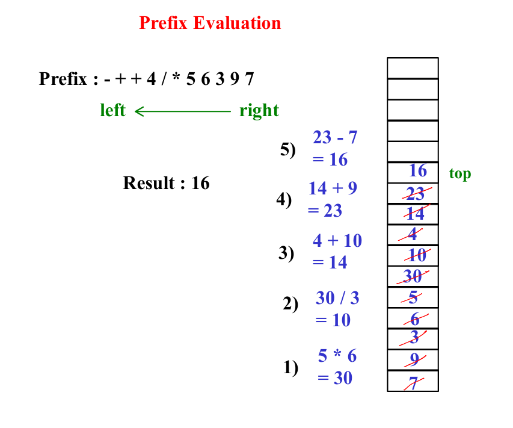
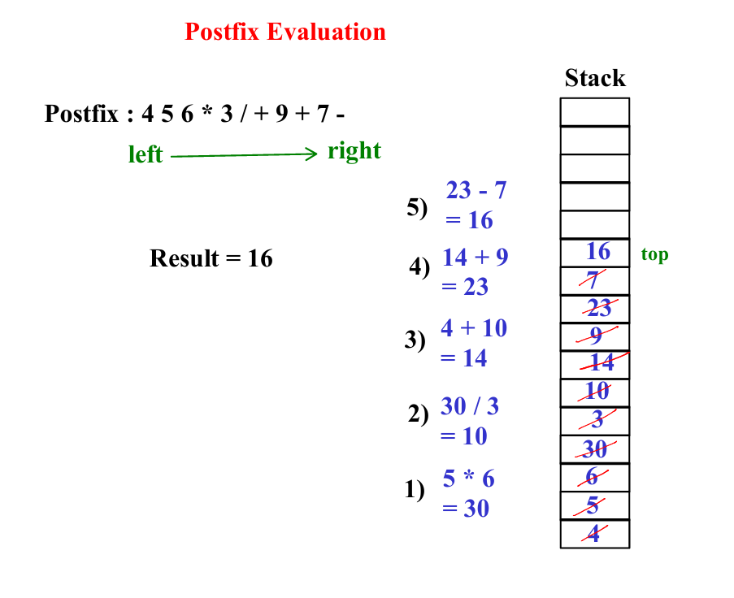
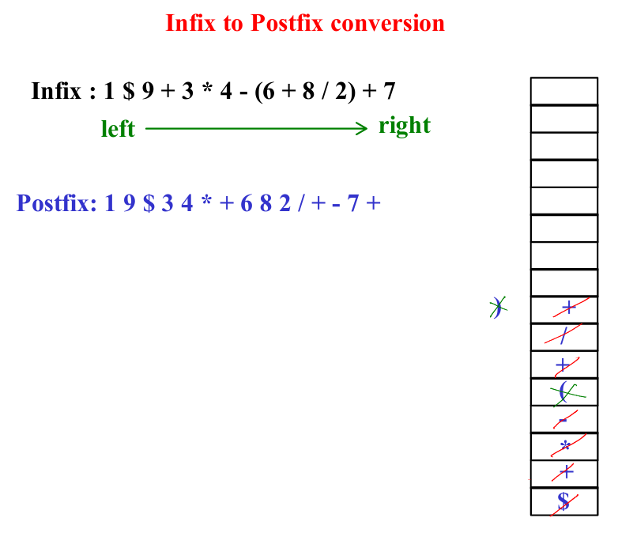
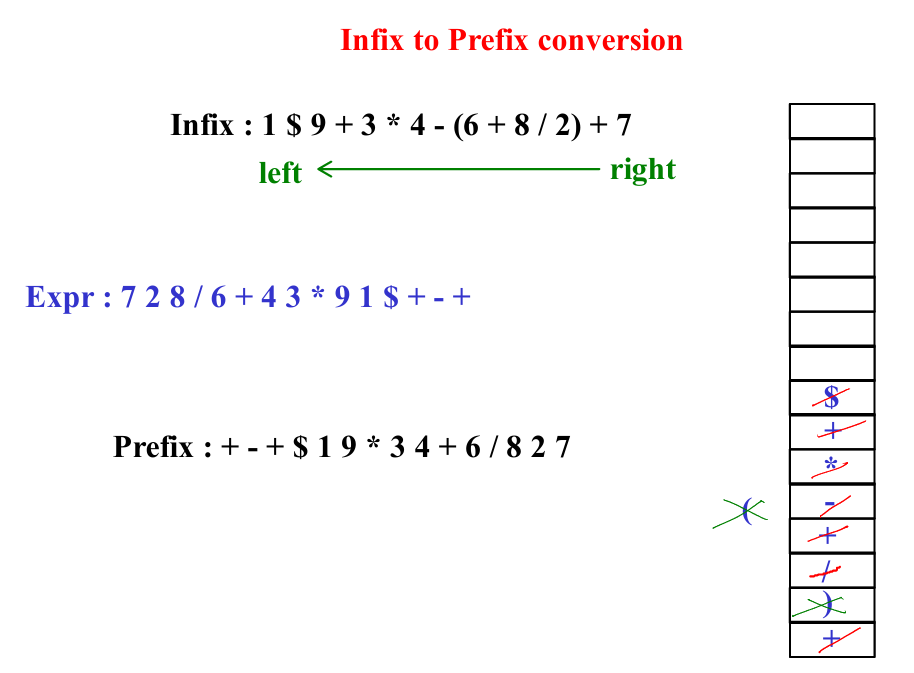

# Stack and Queue: Notes & Interview Questions

## **Stack**

A Stack is a linear data structure that follows the **Last In, First Out (LIFO)** principle. The element added last will be removed first.

### **Key Operations:**

1. **Push**: Add an element to the top of the stack.
2. **Pop**: Remove the top element from the stack.
3. **Peek/Top**: Get the top element without removing it.
4. **isEmpty**: Check if the stack is empty.

### **Applications of Stack:**
- **Backtracking**: E.g., undo operations in editors.
- **Expression Evaluation**: E.g., postfix or prefix expression.
- **Function Call Stack**: For managing function calls.

### **Common Interview Questions:**

1. **Implement a Stack using Arrays or Linked List.**   
    - Using Arrays: 
```java
public class StackArray {
    private int maxSize;
    private int top;
    private int[] stackArray;

    public StackArray(int size) {
        maxSize = size;
        stackArray = new int[maxSize];
        top = -1;
    }

    public void push(int value) throws Exception {
        if (top >= maxSize - 1) {
            throw new Exception("Stack is full. Cannot push element.");
        }
        stackArray[++top] = value;
    }

    public int pop() throws Exception {
        if (top < 0) {
            throw new Exception("Stack is empty. Cannot pop element.");
        }
        return stackArray[top--];
    }

    public boolean isEmpty() {
        return (top == -1);
    }

    public int peek() throws Exception {
        if (top < 0) {
            throw new Exception("Stack is empty.");
        }
        return stackArray[top];
    }
}
```
- Using Linked List: 
```java
class Node {
    int data;
    Node next;

    public Node(int data) {
        this.data = data;
        this.next = null;
    }
}
public class StackLinkedList {
    private Node top;

    public void push(int value) {
        Node newNode = new Node(value);
        if (top == null) {
            top = newNode;
        } else {
            newNode.next = top;
            top = newNode;
        }
    }

    public int pop() throws Exception {
        if (top == null) {
            throw new Exception("Stack is empty. Cannot pop element.");
        }
        int value = top.data;
        top = top.next;
        return value;
    }

    public boolean isEmpty() {
        return (top == null);
    }

    public int peek() throws Exception {
        if (top == null) {
            throw new Exception("Stack is empty.");
        }
        return top.data;
    }
}
```

2. **Design a stack that supports push, pop, top, and retrieving the minimum element in constant time.**
```java
class MinStack {
    private int[] stack;
    private int[] minStack;
    private int top;
    private int capacity;

    public MinStack(int capacity) {
        this.capacity = capacity;
        stack = new int[capacity];
        minStack = new int[capacity];
        top = -1; // Indicates an empty stack
    }

    public void push(int val) {
        if (top == capacity - 1) {
            throw new StackOverflowError("Stack is full");
        }
        top++;
        stack[top] = val;

        // Push to minStack
        if (top == 0) {
            minStack[top] = val; // First element is the minimum
        } else {
            minStack[top] = Math.min(val, minStack[top - 1]);
        }
    }

    public void pop() {
        if (top == -1) {
            throw new IllegalStateException("Stack is empty");
        }
        top--;
    }

    public int top() {
        if (top == -1) {
            throw new IllegalStateException("Stack is empty");
        }
        return stack[top];
    }

    public int getMin() {
        if (top == -1) {
            throw new IllegalStateException("Stack is empty");
        }
        return minStack[top];
    }

    public boolean isEmpty() {
        return top == -1;
    }
}

```
3. **Implement a balanced parentheses checker using a stack.**
```java
    public static boolean isBalanced(String expression) {
        Stack<Character> stack = new Stack<>();

        for (char ch : expression.toCharArray()) {
            if (ch == '(' || ch == '{' || ch == '[') {
                stack.push(ch);
            } else if (ch == ')' || ch == '}' || ch == ']') {
                if (stack.isEmpty()) {
                    return false;
                }
                char top = stack.pop();
                if (!isMatchingPair(top, ch)) {
                    return false;
                }
            }
        }
        return stack.isEmpty();
    }

    private static boolean isMatchingPair(char opening, char closing) {
        return (opening == '(' && closing == ')') ||
               (opening == '{' && closing == '}') ||
               (opening == '[' && closing == ']');
    }
```
4. **Evaluate a postfix & prefix expression using a stack.**
 
```java
	public static int calculate(int op1, int op2, char ch) {
		switch(ch)
		{
			case '+':	return op1 + op2;
			case '-':	return op1 - op2;
			case '*':	return op1 * op2;
			case '/':	return op1 / op2;
			case '%':	return op1 % op2;
			case '$':	return (int)Math.pow(op1, op2);				
		}
		return 0;
	}
	
	public static int postfixEvalate(String postfix) {
		int result;
		Stack st = new Stack(16);
		for(int i = 0 ; i < postfix.length() ; i++) {
			char ch = postfix.charAt(i);
			if(Character.isDigit(ch))
				st.push((int)ch - 48); /* or st.push((int)ch - (int)'0');  
                                        or st.push(Character.getNumericValue(ch)); */
			else {
				// 6. pop two elements from stack
				int op2 = st.pop();	
				int op1 = st.pop();	
				result = calculate(op1, op2, ch);
				st.push(result);
			}
		}
		//9. pop result from stack and return it
		result = st.pop();
		return result;
	}
	
	public static int prefixEvalate(String prefix) {
		int result;
		Stack st = new Stack(16);
		for(int i = prefix.length()-1 ; i >= 0 ; i--) {
			char ch = prefix.charAt(i);
			if(Character.isDigit(ch))
				st.push((int)ch - 48);
			else {
				// 6. pop two elements from stack
				int op1 = st.pop();
				int op2 = st.pop();	
				result = calculate(op1, op2, ch);
				st.push(result);
			}
		}
		result = st.pop();
		return result;
	}
```
---
5. **Convert expression using a stack.**

```java

	public static int priority(char opr) {
		switch (opr) {
		case '$':	return 10;
		case '*':	return 9;
		case '/':	return 9;
		case '%':	return 9;
		case '+':	return 8;
		case '-':	return 8;
		case '(':	return 7;
		}
		return 0;
	}
	
	public static String infixToPostfix(String infix) {
		StringBuilder postfix = new StringBuilder();
		Stack st = new Stack(16);
		for(int i = 0 ; i < infix.length() ; i++) {
			char ch = infix.charAt(i);
			if(Character.isDigit(ch))
				postfix.append((char)ch);
			else if(ch == '(')
				st.push(ch);
			else if(ch == ')') {
				while(st.peek() != '(')
					postfix.append((char)st.pop());
				st.pop();
			}
			else {
				while(!st.isEmpty() && (priority((char)st.peek()) >= priority(ch))){
					postfix.append((char)st.pop());
				}
				st.push(ch);
			}
		}
		while(!st.isEmpty()){
			postfix.append((char)st.pop());
		}
		return postfix.toString();
	}
	
	public static String infixToPrefix(String infix) {
		StringBuilder prefix = new StringBuilder();
		Stack st = new Stack(16);
		for(int i = infix.length()-1 ; i >= 0 ; i--) {
			char ch = infix.charAt(i);
			if(Character.isDigit(ch))
				prefix.append((char)ch);
			else if(ch == ')')
				st.push(ch);
			else if(ch == '(') {
				while(st.peek() != ')')
					prefix.append((char)st.pop());
				st.pop();
			}
			else {
				while(!st.isEmpty() && priority((char)st.peek()) > priority(ch))
					prefix.append((char)st.pop());
				st.push(ch);
			}
		}
		while(!st.isEmpty())
			prefix.append((char)st.pop());
		prefix.reverse();
		return prefix.toString();
	}
```
6. **Reverse a stack using recursion.**
```java
    public static void reverseStack(Stack<Integer> stack) {
            if (stack.isEmpty()) {
                return;
            }

            int temp = stack.pop();
            reverseStack(stack);
            insertAtBottom(stack, temp);
        }

    public static void insertAtBottom(Stack<Integer> stack, int element) {
        if (stack.isEmpty()) {
            stack.push(element);
            return;
        }

        int temp = stack.pop();
        insertAtBottom(stack, element);
        stack.push(temp);
    }
```
Total Time Complexity = O(𝑛) × O(𝑛) = O(𝑛^2)

---

## **Queue**

A Queue is a linear data structure that follows the **First In, First Out (FIFO)** principle. The element added first will be removed first.

### **Key Operations:**

1. **Enqueue**: Add an element to the back of the queue.
2. **Dequeue**: Remove the element from the front of the queue.
3. **Front/Peek**: Get the front element without removing it.
4. **isEmpty**: Check if the queue is empty.

### **Applications of Queue:**
- **CPU Scheduling**: E.g., Round Robin Scheduling.
- **Breadth-First Search (BFS)**: In graph or tree traversal.
- **Data Buffers**: E.g., IO Buffers, task queues.

### **Common Interview Questions:**

1. **Implement a Queue using Arrays or Linked List.**
    - Using Arrays:
```java
	private int arr[];
	private int front, rear;
	private final int SIZE;
	public LinearQueue(int size){
		SIZE = size;
		arr = new int[SIZE];
		front = -1;
		rear = -1;
	}
	public void push(int data){
		//1. reposition rear (inc)
		rear++;
		//2. add data(element) at rear index
		arr[rear] = data;
	}
	
	public void pop() {
		// 1. reposition front (inc)
		front++;
	}
	
	public int peek() {
		//1. read data from front end (front + 1 index)
		return arr[front + 1];
	}
	
	public boolean isFull() {
		return rear == SIZE - 1;
	}
	
	public boolean isEmpty() {
		return rear == front;
	}
```   
    - Using LL
```java
 private Node front, rear;
    private int size;

    // Constructor to initialize the queue
    public LinkedQueue() {
        front = rear = null;
        size = 0;
    }

    // Enqueue (add element to queue)
    public void enqueue(int element) {
        Node newNode = new Node(element);
        if (isEmpty()) {
            front = rear = newNode;
        } else {
            rear.next = newNode;
            rear = newNode;
        }
        size++;
    }

    // Dequeue (remove element from queue)
    public int dequeue() {
        if (isEmpty()) {
            System.out.println("Queue is empty");
            return -1;
        }
        int element = front.data;
        front = front.next;
        if (front == null) {
            rear = null;
        }
        size--;
        return element;
    }

    // Check if the queue is empty
    public boolean isEmpty() {
        return front == null;
    }

    // Get the front element
    public int peek() {
        if (isEmpty()) {
            System.out.println("Queue is empty");
            return -1;
        }
        return front.data;
    }

    // Get the current size of the queue
    public int getSize() {
        return size;
    }
```


2. **Design a circular queue and implement its operations.**
- METHOD 1: 
```java
private int[] arr;
	private int front, rear;
	private int count;
	private final int SIZE;
	public CircularQueue(int size) {
		SIZE = size;
		arr = new int[SIZE];
		front = -1;
		rear = -1;
		count = 0;
	}
	
	public void push(int data) {
		//1. reposition rear (inc)
		rear = (rear + 1) % SIZE;
		//2. add data(element) at rear index
		arr[rear] = data;
		//3. increament count
		count++;
	}
	
	public void pop() {
		//1. reposition front (inc)
		front = (front + 1) % SIZE;
		//2. decrement count
		count--;
	}
	
	public int peek() {
		// 1. read data from front end (front + 1 index)
		return arr[(front + 1) % SIZE];
	}
	
	public boolean isEmpty() {
		return count == 0;
	}
	
	public boolean isFull() {
		return count == SIZE;
	}
```
- METHOD 2: 
```java
	private int[] arr;
	private int front, rear;
	private final int SIZE;
	public CircularQueue(int size) {
		SIZE = size;
		arr = new int[SIZE];
		front = -1;
		rear = -1;
	}
	
	public void push(int data) {
		//1. reposition rear (inc)
		rear = (rear + 1) % SIZE;
		//2. add data(element) at rear index
		arr[rear] = data;
	}
	
	public void pop() {
		//1. reposition front (inc)
		front = (front + 1) % SIZE;
		//
		if(front == rear)
			front = rear = -1;
	}
	
	public int peek() {
		// 1. read data from front end (front + 1 index)
		return arr[(front + 1) % SIZE];
	}
	
	public boolean isEmpty() {
		return rear == front && rear == -1;
	}
	
	public boolean isFull() {
		return (front == -1 && rear == SIZE -1) || (rear == front && rear != -1);
	}
```
3. **Implement a queue using two stacks.**
```java
public class QueueUsingTwoStacks<T> {
    private Stack<T> stack1;
    private Stack<T> stack2;

    public QueueUsingTwoStacks() {
        stack1 = new Stack<>();
        stack2 = new Stack<>();
    }

    // Enqueue an element into the queue
    public void enqueue(T element) {
        stack1.push(element);
    }

    // Dequeue an element from the queue
    public T dequeue() {
        // If both stacks are empty, there's no element to dequeue
        if (stack1.isEmpty() && stack2.isEmpty()) {
            throw new RuntimeException("Queue is empty");
        }

        // If stack2 is empty, transfer all elements from stack1 to stack2
        if (stack2.isEmpty()) {
            while (!stack1.isEmpty()) {
                stack2.push(stack1.pop());
            }
        }

        // Pop the element from stack2, which simulates dequeuing
        return stack2.pop();
    }

    // Check if the queue is empty
    public boolean isEmpty() {
        return stack1.isEmpty() && stack2.isEmpty();
    }

    // Get the size of the queue
    public int size() {
        return stack1.size() + stack2.size();
    }
}
```
4. **Generate binary numbers from 1 to n using a queue.**
```java
import java.util.LinkedList;
import java.util.Queue;

public class BinaryNumberGenerator {
    // Function to generate binary numbers from 1 to n
    public static void generateBinaryNumbers(int n) {
        // Create an empty queue of strings
        Queue<String> queue = new LinkedList<>();

        // Enqueue the first binary number
        queue.add("1");

        // Run a loop for generating binary numbers from 1 to n
        for (int i = 1; i <= n; i++) {
            // Dequeue the front of the queue
            String current = queue.poll();

            // Print the current binary number
            System.out.println(current);

            // Enqueue the next two binary numbers by appending "0" and "1" to the current number
            queue.add(current + "0");
            queue.add(current + "1");
        }
    }

    public static void main(String[] args) {
        int n = 10; // Specify how many binary numbers you want to generate
        generateBinaryNumbers(n);
    }
}

```
---

## **Additional Topics for Interviews:**

### **1. Stack vs Queue**
- **Stack**: LIFO (Last In First Out)
- **Queue**: FIFO (First In First Out)

### **2. Circular Queue**
A circular queue connects the end of the queue back to the front, forming a circle. This ensures better utilization of space.

### **3. Priority Queue**
A priority queue is a special type of queue where elements are removed based on priority rather than just the order they entered.

### **4. Deque (Double-ended Queue)**
A deque allows insertion and removal of elements from both the front and back of the queue.

### **5. Monotonic Stack/Queue**
Used in problems that require tracking the next or previous greater/smaller element.

---

## **Behavioral Interview Questions Related to Data Structures:**
1. **How do you approach designing a new data structure for a specific problem?**
2. **Can you talk about a time when you optimized a solution for better performance using a data structure?**
3. **How do you decide when to use a stack vs. a queue in real-world applications?**

---
