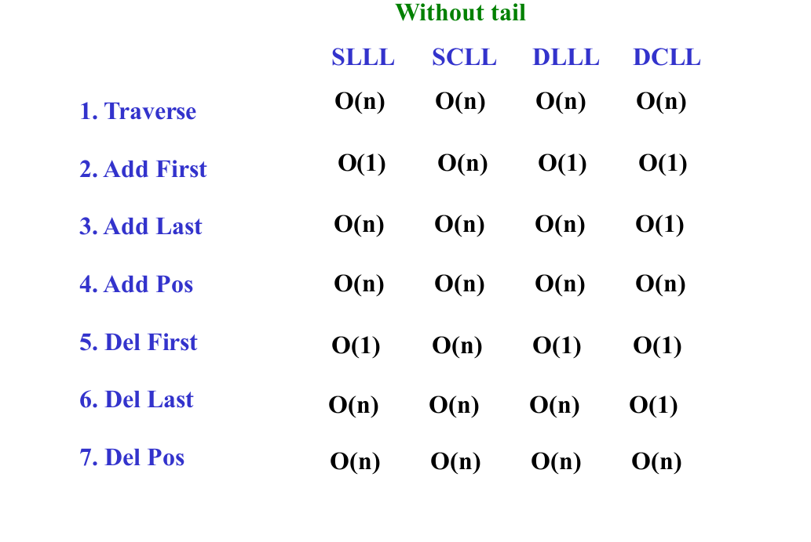
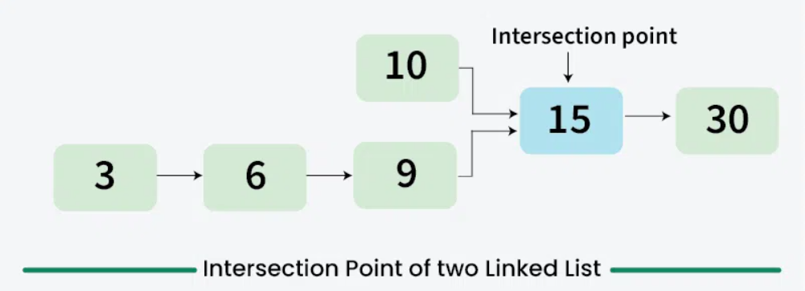
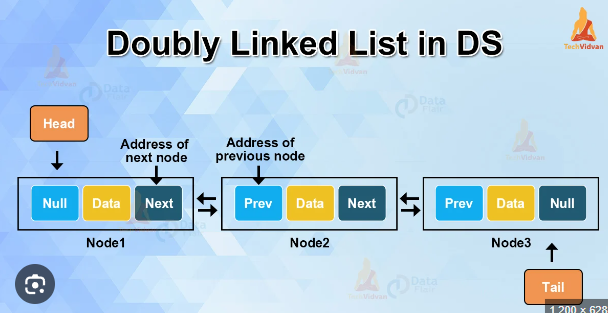

# Arrays vs Linked List

| Feature               | **Array**                               | **Linked List**                         |
|-----------------------|-----------------------------------------|-----------------------------------------|
| **Structure**          | Contiguous memory blocks                | Nodes containing data and references to the next node |
| **Memory Allocation**  | Fixed size (must specify size at creation) | Dynamic size (grows/shrinks as needed)  |
| **Access Time**        | O(1) (direct access via index)          | O(n) (traversal needed to access)       |
| **Insertion**          | O(n) (requires shifting elements)       | O(1) for insertion at the head (O(n) for insertion at a specific position) |
| **Deletion**           | O(n) (requires shifting elements)       | O(1) for deletion at the head (O(n) for deletion at a specific position) |
| **Memory Usage**       | Allocates extra memory for unused capacity | Efficient memory usage, but extra memory for pointers |
| **Flexibility**        | Fixed size (once declared, size is hard to change) | Dynamic (can grow or shrink at runtime) |

## SLLL (Singly Linear LL):
**Implementation**:
```java
class Node {
    int data;
    Node next;

    Node(int data) {
        this.data = data;
        this.next = null;
    }
}

class LinkedList {
    private Node head;

    // Constructor
    LinkedList() {
        this.head = null;
    }

    public boolean isEmpty() {
        return head == null;
    }

    public void delAll() {
		head = null; // GC will take care of deleting all the nodes
	}

    // ops
}
```

**Basic Ops**: 
1. Add First
```java
public void addFirst(int value) {
    Node newnode = new Node(value);
    if(isEmpty())
        head = newnode;
    else {
        newnode.next = head;
        head = newnode;
    }
}
```
2. Add Last
```java
Node newNode = new Node(data);
if (head == null) {
    head = newNode;
} else {
    Node current = head;
    while (current.next != null) {
        current = current.next;
    }
    current.next = newNode;
}
```
3. Add at position
```java
public void addAtPosition(int data, int position) {
    if (position < 0) {
        System.out.println("Position should be >= 0");
        return;
    }

    Node newNode = new Node(data);
    if (position == 0) {
        addFirst(data);
        return;
    }

    Node current = head;
    for (int i = 0; i < position - 1; i++) {
        if (current == null) {
            System.out.println("Position out of bounds");
            return;
        }
        current = current.next;
    }

    newNode.next = current.next;
    current.next = newNode;
}
```
4. Delete First
```java
public void deleteFirst() {
    if (head == null) {
        System.out.println("List is empty");
        return;
    }
    head = head.next;
}
```
5. Delete Last
```java
public void deleteLast() {
    if (head == null) {
        System.out.println("List is empty");
        return;
    }
    if (head.next == null) {
        head = null;
        return;
    }
    Node current = head;
    while (current.next.next != null) {
        current = current.next;
    }
    current.next = null;
}
```
6. Delete at position 
```java
public void deleteAtPosition(int position) {
    if (head == null) {
        System.out.println("List is empty");
        return;
    }

    if (position < 0) {
        System.out.println("Position should be >= 0");
        return;
    }

    if (position == 0) {
        deleteFirst();
        return;
    }

    Node current = head;
    for (int i = 0; i < position - 1; i++) {
        if (current == null || current.next == null) {
            System.out.println("Position out of bounds");
            return;
        }
        current = current.next;
    }

    if (current.next == null) {
        System.out.println("Position out of bounds");
        return;
    }

    current.next = current.next.next;
}
```
7. Traverse
```java
public void displayList() {
    Node trav = head;
    while(trav != null) {
        System.out.println(trav.data + " ");
        trav = trav.next;
    }
}
```
8. Searching
    - Binary search requires quick access to any element in the list. Linked lists, however, do not provide efficient **random access** because you must traverse the list sequentially to reach a particular element. In a linked list, binary search is not practical or efficient due to its sequential nature.
```java
public boolean search(int data) {
    Node current = head;
    while (current != null) {
        if (current.data == data) {
            return true;
        }
        current = current.next;
    }
    return false;
}
```
9. Sorting 
- Selection Sort:
```java
public void sortList(){
    for(Node i = head ; i.next != null ; i = i.next){
        for(Node j = i.next ; j != null ; j = j.next){
            if(i.data < j.data){
                int temp = i.data;
                i.data = j.data;
                j.data = temp;
            }
        }
    }
}
```
- Merge Sort: (Efficient and preferred for linked lists.)
```java
public void mergeSort() {
    head = mergeSort(head);
}

private Node mergeSort(Node head) {
    if (head == null || head.next == null) {
        return head;
    }

    // Split the list into two halves
    Node middle = getMiddle(head);
    Node nextOfMiddle = middle.next;
    middle.next = null;

    // Recursively sort the sublists
    Node left = mergeSort(head);
    Node right = mergeSort(nextOfMiddle);

    // Merge the sorted sublists
    return merge(left, right);
}

private Node getMiddle(Node head) {
    if (head == null) {
        return head;
    }

    Node slow = head;
    Node fast = head;

    while (fast.next != null && fast.next.next != null) {
        slow = slow.next;
        fast = fast.next.next;
    }

    return slow;
}

private Node merge(Node left, Node right) {
    Node result = null;

    if (left == null) {
        return right;
    }
    if (right == null) {
        return left;
    }

    if (left.data <= right.data) {
        result = left;
        result.next = merge(left.next, right);
    } else {
        result = right;
        result.next = merge(left, right.next);
    }

    return result;
}
```
    
10. Reverse
```java
public void reverseList(){
    Node t1 = head, t2 = head.next, t3;
    while(t2 != null){
        t3 = t2.next;
        t2.next = t1;
        t1 = t2;
        t2 = t3;
    }
    head.next = null; 
    head = t1;
}
```

11. Display Reverse: 
```java
public void forward(Node trav) { // Tail Recursion
    if(trav == null)
        return;
    sysout(trav.data);
    forward(trav.next);
}

public void reverse(Node trav) { // Non-Tail Recursion
    if(trav == null)
        return;
    reverse(trav.next);
    sysout(trav.data);
}
```

12. Middle Element:
```java
public Node findMid(){
    Node fast = head;
    Node slow = head;
    while(fast != null && fast.next != null){
        fast = fast.next.next;
        slow = slow.next;
    }
    return slow;
}
```

13. Detect a Cycle in a Linked List
Floyd's Cycle-Finding Algorithm
```java
public boolean hasCycle(ListNode head) {
    if (head == null || head.next == null) {
        return false; 
    }

    ListNode slow = head;
    ListNode fast = head;

    while (fast != null && fast.next != null) {
        slow = slow.next; // Move slow pointer by 1 step
        fast = fast.next.next; // Move fast pointer by 2 steps

        if (slow == fast) {
            return true; // Cycle detected
        }
    }
    return false; // No cycle
}
```

14. Remove Duplicate from Sorted Linked List 
```java
public ListNode removeDuplicates(ListNode head) {
    if (head == null) {
        return null;
    }

    ListNode current = head;
    while (current != null && current.next != null) {
        if (current.val == current.next.val) {
            current.next = current.next.next;
        } else {
            current = current.next;
        }
    }
    return head;
}
```

15. Intersection Point of Two Linked Lists.

```java
private int getLength(ListNode head) {
    int length = 0;
    ListNode current = head;
    while (current != null) {
        length++;
        current = current.next;
    }
    return length;
}

public ListNode getIntersectionNode(ListNode headA, ListNode headB) {
    if (headA == null || headB == null) {
        return null;
    }

    int lenA = getLength(headA);
    int lenB = getLength(headB);

    while (lenA > lenB) {
        headA = headA.next;
        lenA--;
    }
    while (lenB > lenA) {
        headB = headB.next;
        lenB--;
    }

    while (headA != null && headB != null) {
        if (headA == headB) {
            return headA; // Intersection point
        }
        headA = headA.next;
        headB = headB.next;
    }

    return null; 
}
```

16. Merge two sorted LL:
```java
public Node mergeTwoLists(Node l1, Node l2) {
    Node dummy = new ListNode(-1);
    Node current = dummy;
    
    while (l1 != null && l2 != null) {
        if (l1.val <= l2.val) {
            current.next = l1;
            l1 = l1.next;
        } else {
            current.next = l2;
            l2 = l2.next;
        }
        current = current.next;
    }
    
    if (l1 != null) {
        current.next = l1;
    }
    if (l2 != null) {
        current.next = l2;
    }
    
    return dummy.next;
}
mergeTwoLists(headList1, headList2)
```

