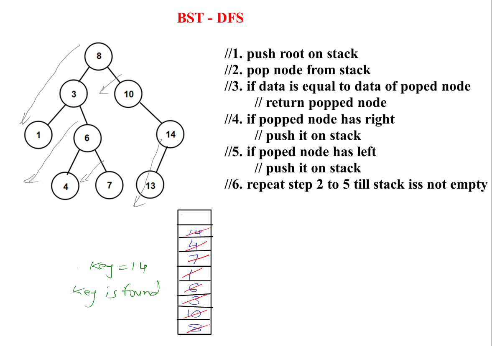

# Tree Data Structure

## Definition
A **Tree** is a widely used abstract data type (ADT) that represents a hierarchical tree structure with a set of connected nodes. Each node contains a value, and the nodes are connected via edges. The tree is an important data structure because it reflects relationships between entities in a hierarchy.

### Key Concepts:
- **Root**: The topmost node of a tree, where the hierarchy starts.
- **Edge**: A connection between two nodes.
- **Child**: A node that has a parent.
- **Parent**: A node that has a child.
- **Leaf**: A node with no children.
- **Subtree**: A tree formed by a node and its descendants.
- **Degree**: The number of children of a node.
- **Depth**: The number of edges from the root to the node.
- **Height**: number of edges present in the longest path connecting that node to a leaf node.
    
- **Level:** Level = depth + 1.


### Types of Trees:
1. **Binary Tree**: A tree where each node has at most two children (referred to as the left child and the right child).
2. **Binary Search Tree (BST)**: A type of binary tree where the left subtree contains nodes with values less than the node, and the right subtree contains nodes with values greater than the node.
3. **AVL Tree**: A self-balancing binary search tree where the difference between heights of left and right subtrees cannot be more than one for all nodes.
4. **Heap Tree**: A complete binary tree where elements are arranged according to a heap property (Min-Heap or Max-Heap).
5. **B-Tree**: A self-balancing tree data structure that maintains sorted data and allows for efficient insertion, deletion, and search operations.
---

### Types of Binary Trees:
- **Full Binary Tree:** Every node has 0 or 2 children.

- **Complete Binary Tree:** All levels are fully filled except possibly for the last level, which is filled **from left to right.**

- **Balanced Binary Tree:** A tree where the height difference between left and right subtrees is minimal, ensuring logarithmic height.
> Balance factor = height(left sub tree) - height(right sub tree)

If balance factors of each node is **either -1, 0 or +1**
then such BST is called as Balanced BST
- **Perfect Binary Tree:** All internal nodes have two children, and all leaves are at the same level.

- **Skewed Binary Tree:** A binary tree where all nodes have only one child (either left or right).


### Formulae: 
- Number of Nodes in a Full Binary Tree: `N = 2^h − 1`
- Number of Leaf Nodes in a Full Binary Tree: `L = (N + 1​)/2` where N is the total number of nodes.
- Height of a Full Binary Tree: with N nodes is: `h = log2(𝑁 + 1)`
- Height of a Binary Tree: `h = log2(𝑁 + 1) − 1`
- Minimum number of leaf nodes `Lmin=1` and the maximum number of leaf nodes: `Lmax = 2^h`
- Catalan Numbers (Number of Binary Search Trees): 


### Definition
A **Binary Search Tree (BST)** is a binary tree with the following properties:
1. Each node in the left subtree is smaller than the root node.
2. Each node in the right subtree is greater than the root node.
3. Both the left and right subtrees are also binary search trees.

### BST (Binary Search Tree):
**Implementation**:
```java
class Node {
    private int data;
    private Node left;
    private Node right;
    public Node() {
        data = 0;
        left = null;
        right = null;
    }
    public Node(int value) {
        data = value;
        left = null;
        right = null;
    }
}

class BSTree {
    private Node root;

	public BSTree() {
		root = null;
	}
	public boolean isEmpty() {
		return root == null;
	}

    // ops
}
```
### Key Operations:
1. **Insertion**: Inserting a new node involves recursively traversing the tree to find the appropriate spot.
```java
public void addNode(int value) {
    Node newnode = new Node(value);
    if(isEmpty())
        root = newnode;
    else {
        Node trav = root;
        while(true) {
                if(value < trav.getData()) {
                    if(trav.left == null) {
                        trav.left = newnode;
                        break;
                    }
                    else 
                        trav = trav.left;
                }
                else {
                    if(trav.right == null) {
                        trav.right = newnode;
                        break;
                    }
                    else
                        trav = trav.right;
                }
        }
    }
}
```
---

2. **Search**: In a BST, searching for an element is efficient with a time complexity of O(log n) in the average case.
```java
public Node searchNode(int key) {
    Node trav = root;
    while(trav != null) {
        if(key == trav.data)
            return trav;
        else if(key < trav.data)
            trav = trav.left;
        else
            trav = trav.right;
    }
    return null;
}
	
public Node searchNodeRec(int key, Node trav) {
    if(trav == null)
        return null;
    if(key == trav.data)
        return trav;
    else if(key < trav.data)
        return searchNodeRec(key, trav.left);
    else
        return searchNodeRec(key, trav.right); 
}
```
---

3. **Traversal**:

**Preorder**
```java
public void preorder(Node trav) {
    if(trav == null)
        return;
    System.out.print(trav.data + ", ");
    preorder(trav.left);
    preorder(trav.right);
}
```

**Inorder**
```java
public void inorder(Node trav) {
    if(trav == null)
        return;
    inorder(trav.left);
    System.out.print(" " + trav.data);
    inorder(trav.right);
}
```

**Postorder**
```java
public void postorder(Node trav) {
    if(trav == null)
        return;
    postorder(trav.left);
    postorder(trav.right);
    System.out.print(" " + trav.data);
}
```

| Characteristics         | BFS                          | DFS                          |
|-------------------------|------------------------------|------------------------------|
| **Order of Visit**      | Level by level               | Depth-first                  |
| **Data Structure**      | Queue                        | Stack (or recursion)         |
| **Shortest Path**       | Guaranteed                    | Not guaranteed               |
| **Memory Usage**        | Efficient for shallow trees   | Efficient for deep trees     |
| **Use Cases**           | Web crawlers(Crawling web pages level by level), social network analysis(Friend Recommendations) | File system traversal |
| **Implementation**      | More complex                 | Simpler (recursive)          |

**BFS**

```java
public void BFS(int key) {
    if (root == null) {
        return;
    }

    Queue<Node> queue = new LinkedList<>();
    queue.add(root);

    while (!queue.isEmpty()) {
        Node trav = queue.poll();
        if(trav.data == key)
            return trav;
        if (trav.left != null) {
            queue.add(trav.left);
        }
        if (trav.right != null) {
            queue.add(trav.right);
        }
    }
}
```
**DFS**

```java
public Node DFS(int key) {
    Stack<Node> st = new Stack<>();
    st.push(root);
    while(!st.isEmpty()) {
        Node trav = st.pop();
        if(trav.data == key)
            return trav;
        if(trav.right != null)
            st.push(trav.right);
        if(trav.left != null)
            st.push(trav.left);
    }
    return null;
}
```
---

4. **Deletion**: Deletion in a BST can be complex. There are three cases to consider:


```java
public Node[] searchNode(int key) {
    Node trav = root;
    Node parent = null;
    while(trav != null) {
        if(trav.data == key)
            break;
        parent = trav;
        if(key < trav.data)
            trav = trav.left;
        else
            trav = trav.right;
    }
    if(trav == null)
        parent = null;
    return new Node[] {trav, parent};
}

public void deleteNode(int value) {
    Node arr[] = searchNode(value);
    Node temp = arr[0], parent = arr[1];
    
    if(temp == null)
        return;
        
    // The node has two children, in which case the node is replaced by its in-order successor or in-order predecessor.
    if(temp.left != null && temp.right != null) {
        //1. find the predecessor of temp
        parent = temp;
        Node pred = temp.left;
        while(pred.right != null) {
            parent = pred;
            pred = pred.right;
        }
        //2. overwrite data of predecessor into data of temp
        temp.data = pred.data;
        //3. mark predecessor for deletion
        temp = pred;
    }
    
    // node which has only right child
    if(temp.left == null && temp.right != null) {
        if(temp == root)
            root = temp.right;
        else if(temp == parent.left)
            parent.left = temp.right;
        else
            parent.right = temp.right;
    }
    // node which has left child
    else if (temp.left != null && temp.right == null){
        if(temp == root)
            root = temp.left;
        else if (temp == parent.left)
            parent.left = temp.left;
        else
            parent.right = temp.left; 
    }
    // Leaf node case (no children)
    else if (temp.left == null && temp.right == null) {
        if (temp == root) {
            root = null; // If the node is the root and a leaf
        } else {
            if (temp == parent.left)
                parent.left = null;
            else
                parent.right = null;
        }
    }
}
```
---

5. **Height of BST**:

```java
public int heightBST(Node trav) {
    if(trav == null)
            return 0;
    int hl = heightBST(trav.left);
    int hr = heightBST(trav.right);
    int max = Integer.max(hl, hr);
    return max + 1;
}
```
---

### Time Complexity:
| Operation                      | Time Complexity (Average Case) | Time Complexity (Worst Case) |
|-------------------------------|-------------------------------|-------------------------------|
| Insertion                     | O(log n)                      | O(n)                          |
| Search                        | O(log n)                      | O(n)                          |
| Deletion                      | O(log n)                      | O(n)                          |
| BFS/DFS/In/Post/Pre-Order     | O(n)                          | O(n)                          |
---

### Balanced BST:


#### Rotations to balance a node:


### Self-Balancing Binary Search Trees:
- **AVL Tree**: 
    - Maintains a balance factor of -1, 0, or 1 to ensure logarithmic height.
    - On every insert and delete, tree is balanced (`by performing rotations`)
    - Most of the operations are performed into `O(log n)`
- **Red-Black Tree**: Another self-balancing tree that ensures balance using a set of rules on node color and rotation.
---

## Interview Questions
- **What are the advantages of a self-balancing tree like AVL or Red-Black Tree?**
    Faster Lookups: AVL trees tend to have faster lookup times compared to Red-Black trees because they are more strictly balanced. This can be beneficial for read-heavy applications.
